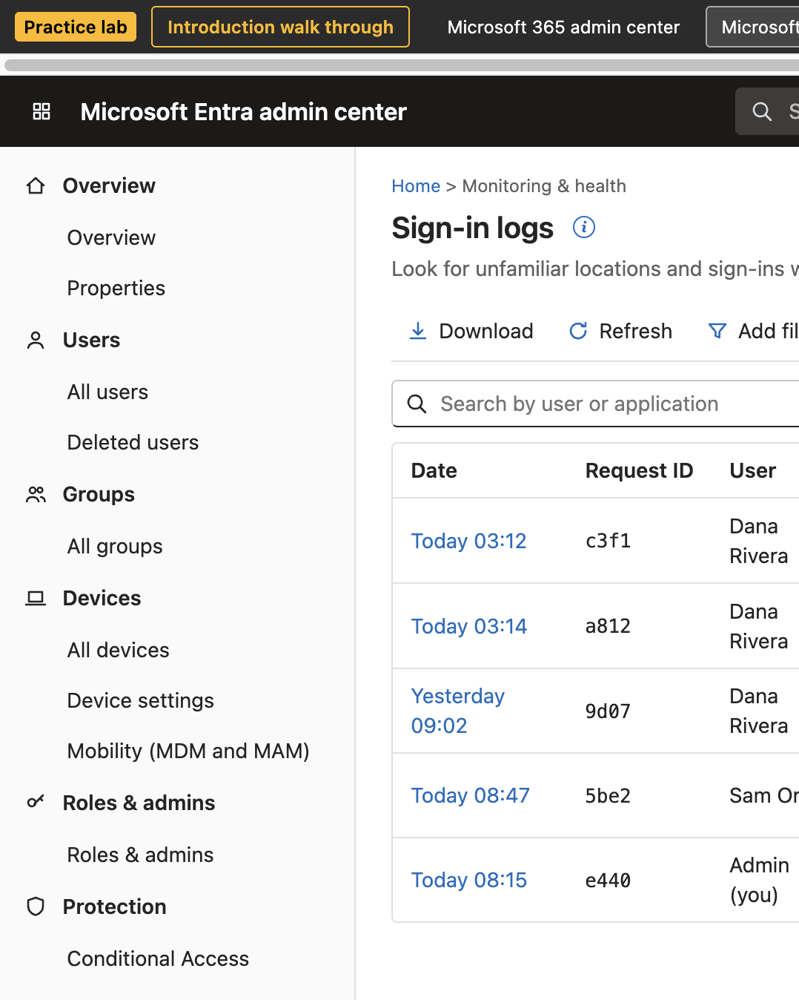

# Admin Practice Lab

Practice real Microsoft 365 admin work with nothing to break. A browser-based simulator of the Microsoft 365 admin center, Entra ID, Intune, Exchange, and a virtual Windows laptop, all linked together. No tenant, no sign-up, no install.

**Try it now:** https://markplowwright.github.io/admin-practice-lab/



> This is a learning simulator. It does not connect to Microsoft, and all users, passwords, and domains in it are fake. Nothing you do here touches a real tenant.

## Why I built this

I'm Mark. When I was learning Microsoft 365 admin work, I kept having to use YouTube to figure out how to do things. I wanted somewhere I could just practice, so I built this to help myself. Then I realized that if I had this trouble, a lot of other people must have it too, so I made it free for anyone who is learning the same things.

## Who it's for

People who want to learn IT admin tasks before they have access to a real tenant: help desk and IT support beginners, career changers, and admins coming from Jamf or Google Admin who are learning Entra ID and Intune.

## How it works

The first time you open it, a welcome page and a 3-minute tour explain the five places you'll work and how missions work (or skip straight to Level 1). You can reopen the introduction at any time with the **Introduction walk through** button in the gray bar at the top. Then you follow a four-level path in the **Lab guide**:

| Level | What you practice |
|---|---|
| 1. Onboarding | Prepare Intune for new laptops, onboard a new hire (usage location, license, groups, Autopilot laptop), license by group |
| 2. Offboarding | Block sign-in, revoke sessions, hand off OneDrive files, reclaim the license and laptop, apply least privilege |
| 3. Compromised accounts and MFA | Contain a compromised account (password, sessions, rogue phone number, mail forwarding), roll out MFA with Conditional Access |
| 4. Intune and laptops | BitLocker disk encryption vs compliance, app deployment, Autopilot setup and enrollment errors, joining a laptop by hand and checking `dsregcmd /status` |

There are 11 missions and 43 steps. Every step names the portal and the menu path and has a **Go there** button. A step is checked off when you actually do it in the lab, and when you finish a mission the guide explains **why it works that way**.

## Coming from Jamf or Google Admin?

Click the **i** icons for plain-English definitions with Jamf and Google Admin equivalents, open the **Jamf / Google** tab in the guide for a concept-by-concept translation, and read the short comparison at the end of each completed mission. The mappings are approximate because each product splits the work differently.

## Realistic failures

Enrollment can fail the way it does in a real tenant: a blocked account, a user outside the MDM user scope, a missing license (error 80180018), or device join disabled (error 801c0003). A joined but unmanaged device is fixed by correcting the scope or license and then syncing.

## Run it locally

No build step. Open `index.html` in a browser, or serve the folder:

```bash
python3 -m http.server 8000
```

The checks behind licenses, enrollment, and mission steps live in `js/rules.js`. From the project folder:

```bash
node --test tests/rules.test.js
```

Progress is saved in your browser's `localStorage`, so it stays on that browser and device. Use **Reset lab** in the guide to start over, or the **Introduction walk through** button to see the intro again.

## Deploy to GitHub Pages

Settings > Pages > Source: **Deploy from a branch** > Branch: `main`, folder `/ (root)`.

## Known limitations

- It is a simulator. Layouts approximate the real portals, which change often, so confirm steps in Microsoft's current documentation before acting on a production tenant.
- Progress is stored only in your browser. Clearing site data resets it.
- Not every real setting exists here. The lab covers the common admin tasks above, not the full product surface.
- Not affiliated with or endorsed by Microsoft, Jamf, or Google.

## Project layout

| File | Purpose |
|---|---|
| `index.html` | Page shell. Loads the styles and scripts below. No build step. |
| `css/app.css` | Layout and portal styles |
| `js/state.js` | Saved tenant, ids, users, and licenses |
| `js/rules.js` | Enrollment rules and mission checks. No page markup. |
| `js/ui.js` | Shared buttons, tables, wizards, and glossary |
| `js/entra.js`, `js/m365.js`, `js/exchange.js`, `js/intune.js` | The four admin centers |
| `js/vm.js` | Virtual Windows laptop |
| `js/guide.js` | Lab guide, welcome page, and tour |
| `js/render.js` | Drawing the page and handling clicks |
| `tests/rules.test.js` | Checks for ids, licenses, enrollment, and mission steps |
| `LICENSE` | MIT |

## Disclaimer

Not affiliated with or endorsed by Microsoft. Portal layouts are approximations for practice, and real portals change often. Always confirm steps in Microsoft's current documentation before acting on a production tenant.
